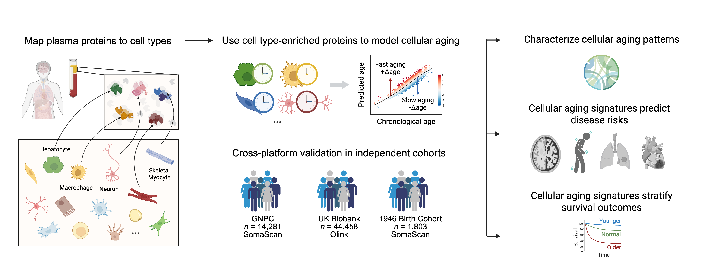

## Cellular Aging Signatures in the Plasma Proteome Record Human Health and Disease

A computational framework for estimating cell-type-specific biological age using plasma proteomics.

## Overview

CellAge provides machine learning models to estimate the biological age of more than 40 distinct cell types—spanning neuronal, immune, glial, endocrine, epithelial, and musculoskeletal origins—using over 7,000 plasma proteins. This framework enables characterization of biological aging at the cellular level, providing insights into aging heterogeneity and its influence on disease vulnerability and resilience.



The CellAge framework consists of three main steps:

1. **Map plasma proteins to cell types**: Identify cell-type-enriched proteins based on the Human Protein Atlas data and map them to plasma proteomics measurements.

2. **Train cell-type-specific aging models**: Build machine learning models for each cell type using cell-type-enriched proteins. Models predict biological age and calculate age gaps for each cell type as the residual between an individual’s predicted cell-type biological age and the model-predicted biological age of an average healthy individual at the same chronological age.

3. **Downstream analyses**: Apply the models to characterize cellular aging patterns, identify associations with diseases, and stratify survival outcomes across independent cohorts.

## Repository Structure

```
cellage/
├── preprocessing/    # Protein-to-cell-type mapping
├── model/           # Cell-type-specific aging model development
└── analysis/        # Downstream analyses using the models
```

## License

This project is licensed under the MIT License - see the [LICENSE](LICENSE) file for details.
